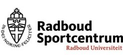

----

  
 

## Achtergrond
Met het onderzoeksproject *Altijd Blijven Sporten!* (ABS) willen we onze kennis vergroten over hoe en waarom de overgang naar het hoger onderwijs gepaard gaan met veranderingen in actieve leefstijlen.

<button class=button1 onclick="myFunction()" id="myButton" value="Click To Open Instructions">Lees meer</button>

 

Een actieve leefstijl heeft veel voordelen. Helaas zien we dat de overgang naar het hoger onderwijs vaak een (blijvend) negatieve invloed heeft op fysieke activiteit. De transitie naar het hoger onderwijs gaat gepaard met een nieuwe studieomgeving, vaak een nieuwe woonomgeving, nieuwe verantwoordelijkheden, en een veranderend sociaal netwerk. 

Dit onderzoeksproject is onderdeel van het grote onderzoeksproject *TRansition Into Active Living* <a href="https://www.ru.nl/activeliving/onderzoek/vm-onderzoek/trial/" target="_blank"><b>(TRIAL)</b></a>. Nieuwe kennis opgedaan door dit onderzoek helpt het Radboud Sportcentrum en andere organisaties om interventies of programma’s te ontwikkelen waarmee een actieve leefstijl na de transitie naar het hoger onderwijs kan worden gepromoot.     

Bekijk het <a href="https://altijdblijvensporten.info/consent.html" target="_blank"><b>informatieformulier</b></a> voor meer informatie over het onderzoek.

----

 

### **En jij kunt daar aan bijdragen!** 

Heb jij eerder dit collegejaar een online vragenlijst ingevuld? Graag leggen we je een soortgelijke vragenlijst voor. Klik de knop hieronder om deel te nemen. We hebben je een uitnodigingsmail gestuurd met daarin een toegangscode (deze is mogelijk in je spam beland!). Heb je geen uitnodigingsmail ontvangen, maar wil je wel meedoen? Stuur dan een mail naar [rob.franken@ru.nl](mailto:rob.franken@ru.nl).

<!---we should move this to a css file and include it

https://www.w3schools.com/csS/css3_buttons.asp

-->

 

<a href="https://limesurvey.jtolsma.nl/limesurvey/limesurvey/index.php/493144?newtest=Y&lang=nl" target="_blank" class="button button2">Start de 2e vragenlijst</a>

----

 

## Beloning 

Uiteraard is deelname volledig vrijwillig. Om deelnemers aan deze tweede vragenlijst te bedanken, ontvangen zij na het volledig invullen van de vragenlijst een **bol.com waardebon t.w.v. 5 euro**. 

 

